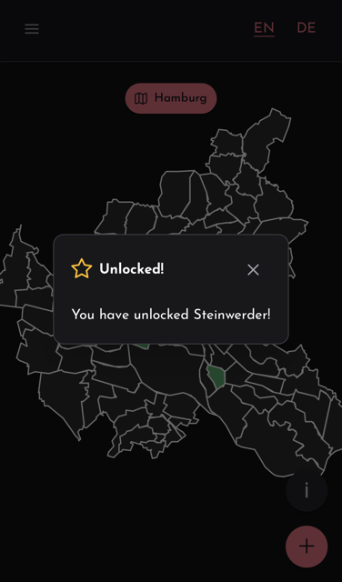

🥳 Version 1.0 of GeoChaser is now out at [geochaser.app](https://geochaser.app)!
--- 

# 📍 GeoChaser

[GeoChaser](https://geochaser.app) is an interactive way of exploring cities, municipalities and countries. Simply by
selecting a photograph with
geodata you can unlock the places of your favorite regions.

GeoChaser works by extracting the geodata from the photograph and comparing it to the coordinates of the selected
region.

### 📸 Image Geodata extraction

The geodata is extracted from the image on the client side using [exifr](https://www.npmjs.com/package/exifr) and being
processed by [PostGIS](https://postgis.net/) on the server. No location data is ever stored!

### 🗺️ Map Data

We use opensource map data from different sources. Check out our [Imprint](https://geochaser.app/imprint) to find out
more.

We currently have map data for:

- Berlin
- Hamburg
- Gießen
- Frankfurt (on the Main)
- Munich
- Vienna

### 💻 Tech Stack

This project is built with:

- [Nuxt](https://nuxt.com/)
- [Vue.js](https://vuejs.org/)
- [PrimeVue](https://primevue.org/)
- [Tailwind CSS for Nuxt](https://tailwindcss.nuxtjs.org/)
- [Prisma](https://www.prisma.io/)

We also use the following dependencies:

- [PostGIS](https://postgis.net/) for geospatial data
- [leafletjs](https://leafletjs.com/) for map rendering
- [exifr](https://www.npmjs.com/package/exifr) for image geodata extraction
- [i18n for Nuxt](https://i18n.nuxtjs.org/) for language support of English and German

### 👥 Contributing

We are always looking for more maps! If you have a region that you would like to see in GeoChaser, please contact
us and provide geodata. We will add it to the map data. Thanks!

We are also always open to feedback and suggestions. This project is far from perfect, and not all features are
finished. So if you see room for improvement, contact us and let us know!